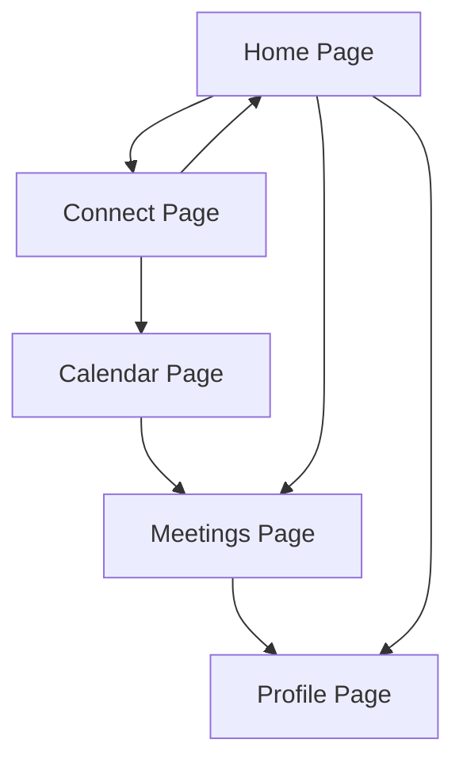

# Calendar Connection App - Product Requirements Document

## 1. Product Overview
A calendar connection platform that enables two users to connect their calendars and automatically find optimal meeting times based on their mutual availability.

The app solves the common scheduling problem by integrating with Cal.com API to access user calendars, analyze availability patterns, and suggest convenient meeting slots for both parties.

## 2. Core Features

### 2.1 User Roles
| Role | Registration Method | Core Permissions |
|------|---------------------|------------------|
| Regular User | Email/Google registration via Firebase Auth | Can connect with other users, link calendars, view suggestions |
| Premium User | Subscription upgrade | Advanced scheduling features, multiple calendar integrations, priority support |

### 2.2 Feature Module
Our calendar connection app consists of the following main pages:
1. **Home page**: user dashboard, connection requests, recent meetings.
2. **Connect page**: search users, send connection requests, manage connections.
3. **Calendar page**: calendar integration setup, availability management, Cal.com linking.
4. **Meetings page**: suggested time slots, meeting scheduling, confirmation system.
5. **Profile page**: user settings, calendar preferences, notification controls.

### 2.3 Page Details
| Page Name | Module Name | Feature description |
|-----------|-------------|---------------------|
| Home page | Dashboard | Display active connections, pending requests, upcoming meetings |
| Home page | Quick Actions | Fast access to connect new user, view calendar, schedule meeting |
| Connect page | User Search | Search users by email, name, or username with real-time results |
| Connect page | Connection Management | Send/accept/decline connection requests, view connection status |
| Calendar page | Cal.com Integration | Link Cal.com account, authenticate calendar access, sync availability |
| Calendar page | Availability Settings | Set working hours, time zones, buffer times between meetings |
| Meetings page | Time Slot Suggestions | Display common free time slots with conflict detection |
| Meetings page | Meeting Scheduler | Create meeting invites, set duration, add meeting details |
| Profile page | Account Settings | Update profile information, notification preferences, privacy settings |
| Profile page | Calendar Preferences | Configure default meeting duration, preferred time ranges |

## 3. Core Process
**User Connection Flow:**
Users register and search for other users to connect with. They send connection requests which must be accepted before calendar integration becomes available.

**Calendar Integration Flow:**
Once connected, users link their Cal.com accounts to share availability data. The system syncs calendar information and identifies mutual free time slots.

**Meeting Scheduling Flow:**
Users view suggested meeting times, select preferred slots, and create meeting invites that are sent to both parties for confirmation.

## 4. User Interface Design
### 4.1 Design Style
- Primary colors: Blue (#2563EB), Green (#10B981)
- Secondary colors: Gray (#6B7280), White (#FFFFFF)
- Button style: Rounded corners with subtle shadows
- Font: Inter, 14px base size for body text, 18px for headings
- Layout style: Clean card-based design with top navigation
- Icons: Heroicons for consistency, calendar and clock emojis for visual appeal

### 4.2 Page Design Overview
| Page Name | Module Name | UI Elements |
|-----------|-------------|-------------|
| Home page | Dashboard | Card layout with connection status, gradient backgrounds, floating action button |
| Connect page | User Search | Search bar with autocomplete, user cards with profile photos, connection status badges |
| Calendar page | Integration Setup | Step-by-step wizard, progress indicators, Cal.com branding integration |
| Meetings page | Time Suggestions | Calendar grid view, time slot cards with availability indicators, conflict warnings |
| Profile page | Settings Panel | Form inputs with validation, toggle switches, profile photo upload |

### 4.3 Responsiveness
Mobile-first responsive design with touch-optimized interactions. Desktop version provides enhanced calendar views and multi-panel layouts for better productivity.