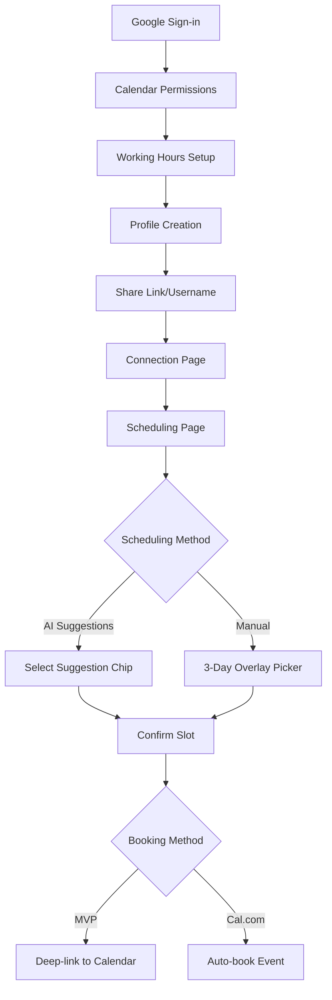

# Smart Calendar Scheduling App - Product Requirements Document

## 1. Product Overview

A standalone scheduling application that streamlines meeting coordination through Google Calendar integration and AI-powered suggestions. Users sign in with Google, share their availability via username/link, and schedule meetings using either AI recommendations or manual time selection with visual calendar overlays.

The product solves the common problem of back-and-forth scheduling emails by providing instant availability visibility and intelligent meeting suggestions, targeting professionals and teams who frequently coordinate meetings across different calendar systems.

## 2. Core Features

### 2.1 User Roles

| Role | Registration Method | Core Permissions |
|------|---------------------|------------------|
| Standard User | Google OAuth sign-in | Can view availability, schedule meetings, share calendar links |
| Connected User | Google OAuth + Cal.com integration | Can auto-book meetings, access Outlook/iCloud calendars |

### 2.2 Feature Module

Our scheduling app consists of the following main pages:

1. **Onboarding page**: Google OAuth integration, calendar permissions setup, working hours configuration.
2. **Profile page**: User settings, working hours management, Cal.com connection, shareable link generation.
3. **Scheduling page**: AI suggestion chips, 3-day manual overlay picker, duration selection, booking confirmation.
4. **Connection page**: User discovery via shared links/usernames, profile viewing, scheduling initiation.

### 2.3 Page Details

| Page Name | Module Name | Feature description |
|-----------|-------------|---------------------|
| Onboarding page | Google OAuth | Authenticate with Google, request calendar.readonly and calendar.events permissions |
| Onboarding page | Cal.com Connect | Optional integration for Outlook/iCloud calendar support |
| Onboarding page | Working Hours Setup | Configure daily working hours, lunch window, timezone preferences |
| Profile page | Settings Management | Edit working hours, lunch breaks, blackout dates, notification preferences |
| Profile page | Link Sharing | Generate and manage shareable profile links and usernames |
| Profile page | Calendar Sources | Manage connected calendar accounts and sync preferences |
| Scheduling page | AI Suggestions | Display 5 suggestion chips: First 30-min, First 1-hour, Morning coffee, Lunch, Dinner |
| Scheduling page | Manual Overlay | 3-day calendar view with color-coded availability (red=busy, yellow=your events, green=free) |
| Scheduling page | Duration Lock | Set and lock meeting duration with minDuration == maxDuration |
| Scheduling page | Booking Confirmation | Floating confirm button, confirmation dialog, deep-link or Cal.com booking |
| Connection page | User Discovery | Access other users via shared links or username search |
| Connection page | Profile Viewing | View other user's availability and initiate scheduling |

## 3. Core Process

**Standard User Flow:**
1. User signs in with Google and grants calendar permissions
2. User configures working hours and preferences
3. User shares their profile link/username with others
4. Other users access the profile and initiate scheduling
5. Scheduling interface shows AI suggestions and manual overlay options
6. User selects preferred time slot and confirms
7. System generates deep-link to Google/Outlook Calendar for event creation

**Connected User Flow (Cal.com):**
1. Follow steps 1-6 from Standard User Flow
2. System automatically creates calendar event via Cal.com API
3. Both participants receive calendar invitations

## 4. User Interface Design

### 4.1 Design Style

- **Primary Colors**: Google Blue (#4285F4), Success Green (#34A853)
- **Secondary Colors**: Warning Yellow (#FBBC04), Error Red (#EA4335), Neutral Gray (#9AA0A6)
- **Button Style**: Rounded corners (8px radius), Material Design elevation
- **Font**: Google Sans, 14px base size, 16px for headers
- **Layout Style**: Card-based design with clean spacing, top navigation with user avatar
- **Icons**: Material Design icons, calendar and scheduling-focused emoji (📅, ⏰, ☕)

### 4.2 Page Design Overview

| Page Name | Module Name | UI Elements |
|-----------|-------------|-------------|
| Onboarding page | Google OAuth | Large "Sign in with Google" button, permission explanation cards, progress indicators |
| Onboarding page | Working Hours Setup | Time picker components, timezone dropdown, visual schedule grid |
| Profile page | Settings Management | Form inputs with validation, toggle switches, time range selectors |
| Profile page | Link Sharing | Copy-to-clipboard button, QR code generation, social sharing options |
| Scheduling page | AI Suggestions | 5 colored chip buttons with icons, loading states, earliest available time display |
| Scheduling page | Manual Overlay | 3-column calendar grid, color-coded time slots, event title tooltips, floating action button |
| Scheduling page | Booking Confirmation | Modal dialog with slot details, participant info, booking method selection |
| Connection page | User Discovery | Search bar, user cards with availability preview, connection status indicators |

### 4.3 Responsiveness

Desktop-first design with mobile-adaptive layouts. Touch interaction optimization for mobile overlay picker with larger touch targets (44px minimum). Responsive breakpoints at 768px (tablet) and 480px (mobile) with collapsible navigation and stacked card layouts.