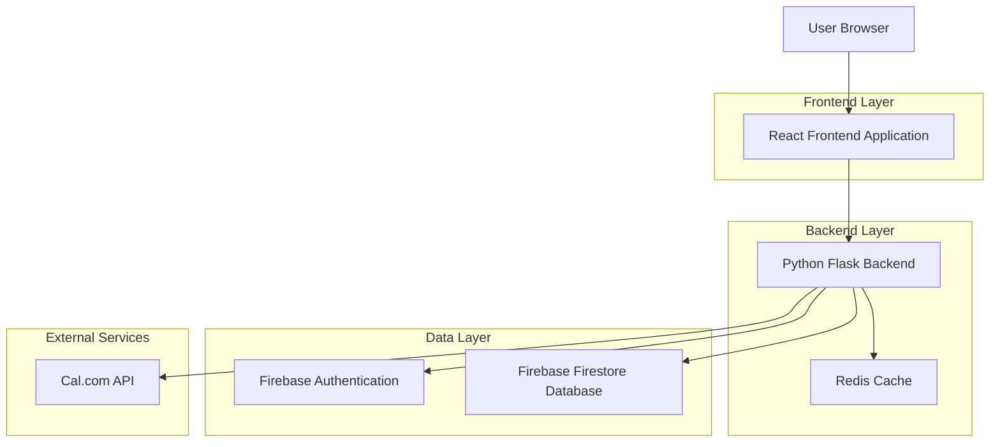
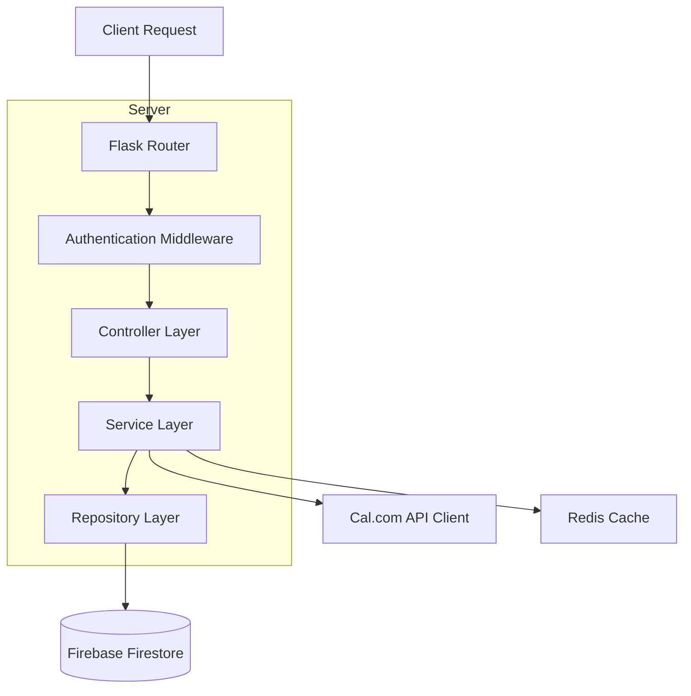
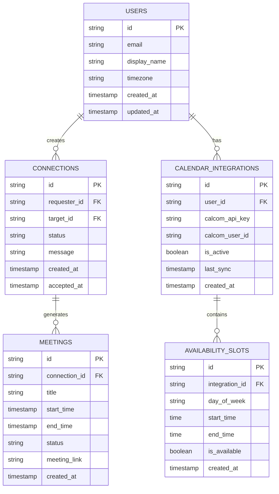

# Calendar Connection App - Technical Architecture Document

## 1. Architecture Design



## 2. Technology Description
- Frontend: React@18 + tailwindcss@3 + vite
- Backend: Python Flask@2.3 + firebase-admin@6.2 + requests@2.31
- Database: Firebase Firestore
- Cache: Redis@7.0
- External API: Cal.com API v1

## 3. Route Definitions
| Route | Purpose |
|-------|---------|
| /home | Home dashboard displaying connections and meetings |
| /connect | User search and connection management |
| /calendar | Calendar integration and availability settings |
| /meetings | Meeting suggestions and scheduling interface |
| /profile | User profile and preferences management |
| /login | Firebase authentication login page |
| /register | User registration with Firebase Auth |

## 4. API Definitions

### 4.1 Core API

**User Authentication**
```
POST /api/auth/verify-token
```
Request:
| Param Name | Param Type | isRequired | Description |
|------------|------------|------------|-------------|
| token | string | true | Firebase ID token |

Response:
| Param Name | Param Type | Description |
|------------|------------|-------------|
| success | boolean | Authentication status |
| user_id | string | Firebase user ID |

**Connection Management**
```
POST /api/connections/request
```
Request:
| Param Name | Param Type | isRequired | Description |
|------------|------------|------------|-------------|
| target_email | string | true | Email of user to connect with |
| message | string | false | Optional connection message |

Response:
| Param Name | Param Type | Description |
|------------|------------|-------------|
| success | boolean | Request status |
| connection_id | string | Unique connection identifier |

**Calendar Integration**
```
POST /api/calendar/connect-calcom
```
Request:
| Param Name | Param Type | isRequired | Description |
|------------|------------|------------|-------------|
| calcom_api_key | string | true | Cal.com API key |
| calcom_user_id | string | true | Cal.com user identifier |

Response:
| Param Name | Param Type | Description |
|------------|------------|-------------|
| success | boolean | Integration status |
| sync_status | string | Calendar sync result |

**Meeting Suggestions**
```
GET /api/meetings/suggestions/{connection_id}
```
Response:
| Param Name | Param Type | Description |
|------------|------------|-------------|
| suggestions | array | Available time slots |
| timezone | string | Suggested timezone |

Example Response:
```json
{
  "suggestions": [
    {
      "start_time": "2024-01-15T14:00:00Z",
      "end_time": "2024-01-15T15:00:00Z",
      "confidence": 0.95
    }
  ],
  "timezone": "America/New_York"
}
```

## 5. Server Architecture Diagram



## 6. Data Model

### 6.1 Data Model Definition



### 6.2 Data Definition Language

**Users Collection (users)**
```javascript
// Firestore collection structure
{
  "id": "auto-generated-doc-id",
  "email": "user@example.com",
  "display_name": "John Doe",
  "timezone": "America/New_York",
  "created_at": "2024-01-01T00:00:00Z",
  "updated_at": "2024-01-01T00:00:00Z"
}

// Firestore security rules
rules_version = '2';
service cloud.firestore {
  match /databases/{database}/documents {
    match /users/{userId} {
      allow read, write: if request.auth != null && request.auth.uid == userId;
    }
  }
}
```

**Connections Collection (connections)**
```javascript
{
  "id": "auto-generated-doc-id",
  "requester_id": "firebase-user-id-1",
  "target_id": "firebase-user-id-2",
  "status": "pending", // pending, accepted, declined
  "message": "Let's connect our calendars!",
  "created_at": "2024-01-01T00:00:00Z",
  "accepted_at": null
}

// Security rules
match /connections/{connectionId} {
  allow read, write: if request.auth != null && 
    (request.auth.uid == resource.data.requester_id || 
     request.auth.uid == resource.data.target_id);
}
```

**Calendar Integrations Collection (calendar_integrations)**
```javascript
{
  "id": "auto-generated-doc-id",
  "user_id": "firebase-user-id",
  "calcom_api_key": "encrypted-api-key",
  "calcom_user_id": "calcom-user-identifier",
  "is_active": true,
  "last_sync": "2024-01-01T12:00:00Z",
  "created_at": "2024-01-01T00:00:00Z"
}

// Security rules
match /calendar_integrations/{integrationId} {
  allow read, write: if request.auth != null && 
    request.auth.uid == resource.data.user_id;
}
```

**Initial Data Setup**
```python
# Python script for initial Firestore setup
import firebase_admin
from firebase_admin import credentials, firestore

# Initialize Firebase Admin SDK
cred = credentials.Certificate('path/to/serviceAccountKey.json')
firebase_admin.initialize_app(cred)
db = firestore.client()

# Create initial collections with sample data
sample_user = {
    'email': 'demo@example.com',
    'display_name': 'Demo User',
    'timezone': 'UTC',
    'created_at': firestore.SERVER_TIMESTAMP,
    'updated_at': firestore.SERVER_TIMESTAMP
}

db.collection('users').add(sample_user)
```