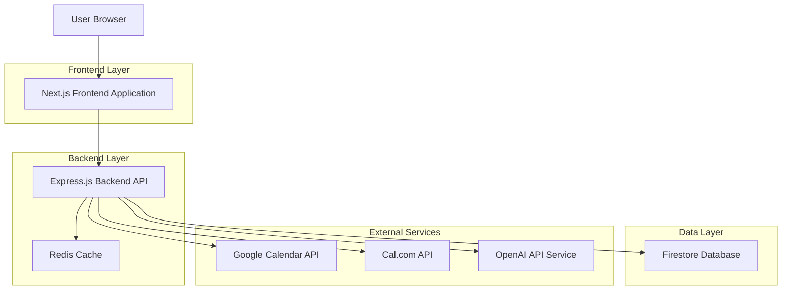
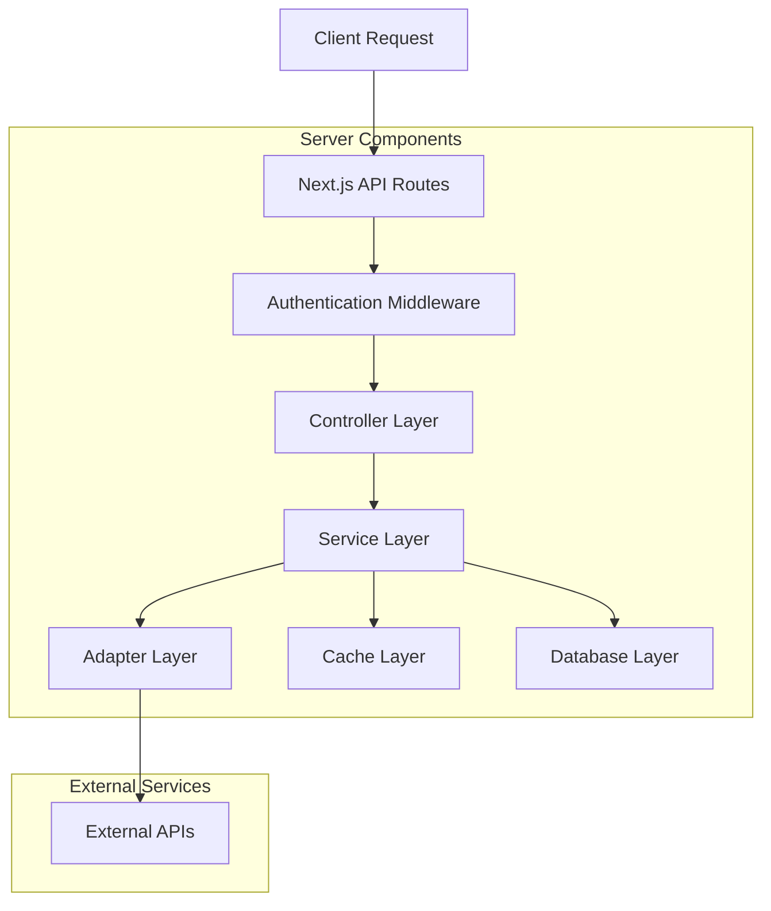
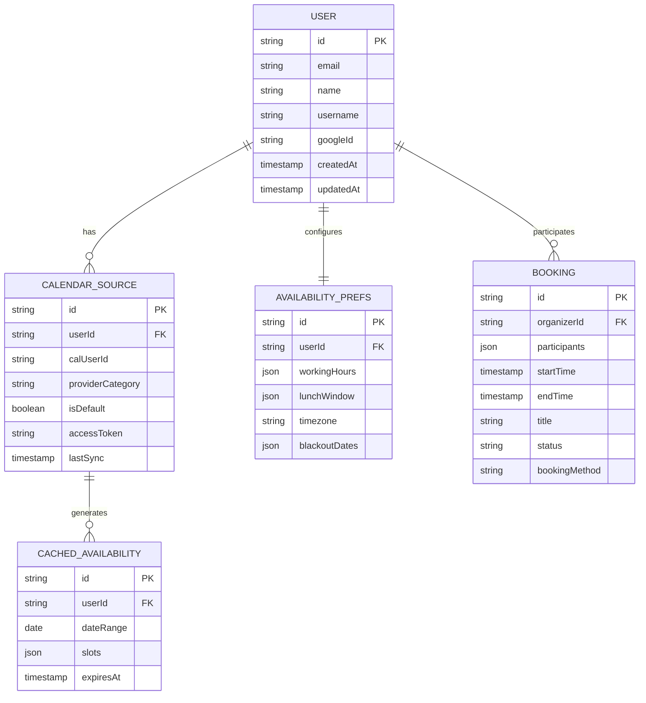

# Smart Calendar Scheduling App - Technical Architecture Document

## 1. Architecture Design



## 2. Technology Description

- Frontend: Next.js@14 + TypeScript + Tailwind CSS + React@18
- Backend: Express@4 + TypeScript + Node.js
- Database: Firestore (Google Cloud)
- Cache: Redis (5-10 min TTL)
- Authentication: Google OAuth 2.0
- External APIs: Google Calendar API, Cal.com API, OpenAI API

## 3. Route Definitions

| Route | Purpose |
|-------|----------|
| / | Landing page with sign-in options |
| /onboarding | Initial setup flow for new users |
| /profile | User settings and preferences management |
| /schedule/[username] | Scheduling interface for specific user |
| /connect | User discovery and connection management |
| /auth/callback | OAuth callback handling |

## 4. API Definitions

### 4.1 Core API

**Authentication**
```
POST /api/auth/google
```
Request:
| Param Name | Param Type | isRequired | Description |
|------------|------------|------------|-------------|
| code | string | true | Google OAuth authorization code |
| state | string | false | CSRF protection state |

Response:
| Param Name | Param Type | Description |
|------------|------------|-------------|
| token | string | JWT access token |
| user | UserProfile | User profile information |

**Availability Management**
```
GET /api/availability
```
Request:
| Param Name | Param Type | isRequired | Description |
|------------|------------|------------|-------------|
| user | string | true | User ID or username |
| from | string | true | Start date (ISO 8601) |
| to | string | true | End date (ISO 8601) |

Response:
| Param Name | Param Type | Description |
|------------|------------|-------------|
| slots | AvailabilitySlot[] | Available time slots |
| busy | BusySlot[] | Busy time periods |

**Mutual Availability**
```
POST /api/mutual-availability
```
Request:
| Param Name | Param Type | isRequired | Description |
|------------|------------|------------|-------------|
| participants | string[] | true | Array of user IDs |
| range | DateRange | true | Date range to check |
| duration | number | true | Meeting duration in minutes |

Response:
| Param Name | Param Type | Description |
|------------|------------|-------------|
| mutualSlots | TimeSlot[] | Available mutual time slots |

**AI Suggestions**
```
POST /api/suggest
```
Request:
| Param Name | Param Type | isRequired | Description |
|------------|------------|------------|-------------|
| participants | string[] | true | Array of user IDs |
| intents | SuggestionType[] | true | Types of suggestions needed |
| preferences | SchedulingPrefs | false | Additional preferences |

Response:
| Param Name | Param Type | Description |
|------------|------------|-------------|
| suggestions | Suggestion[] | AI-generated time suggestions |

**Booking**
```
POST /api/book
```
Request:
| Param Name | Param Type | isRequired | Description |
|------------|------------|------------|-------------|
| slot | TimeSlot | true | Selected time slot |
| participants | string[] | true | Meeting participants |
| method | BookingMethod | true | 'deeplink' or 'calcom' |
| title | string | false | Meeting title |

Response:
| Param Name | Param Type | Description |
|------------|------------|-------------|
| bookingUrl | string | Deep-link URL or booking confirmation |
| status | string | Booking status |

## 5. Server Architecture Diagram



## 6. Data Model

### 6.1 Data Model Definition



### 6.2 Data Definition Language

**Users Collection (users)**
```javascript
// Firestore collection: users
{
  id: string, // Auto-generated document ID
  email: string,
  name: string,
  username: string, // Unique username for sharing
  googleId: string,
  avatar: string,
  createdAt: Timestamp,
  updatedAt: Timestamp
}

// Firestore indexes
// Composite index on username (ascending)
// Composite index on email (ascending)
```

**Calendar Sources Collection (calendar_sources)**
```javascript
// Firestore collection: calendar_sources
{
  id: string,
  userId: string,
  calUserId: string, // Cal.com user ID
  providerCategory: string, // 'work' | 'personal'
  isDefault: boolean,
  accessToken: string, // Encrypted
  refreshToken: string, // Encrypted
  lastSync: Timestamp,
  createdAt: Timestamp
}

// Firestore indexes
// Composite index on userId (ascending), isDefault (descending)
```

**Availability Preferences Collection (availability_prefs)**
```javascript
// Firestore collection: availability_prefs
{
  id: string,
  userId: string,
  workingHours: {
    monday: { start: '09:00', end: '17:00', enabled: true },
    tuesday: { start: '09:00', end: '17:00', enabled: true },
    // ... other days
  },
  lunchWindow: {
    start: '12:00',
    end: '13:00',
    enabled: true
  },
  timezone: string,
  blackoutDates: Date[],
  createdAt: Timestamp,
  updatedAt: Timestamp
}
```

**Redis Cache Schema**
```javascript
// Redis keys and TTL
// Key: availability:{userId}:{dateRange}
// TTL: 300 seconds (5 minutes)
{
  slots: [
    {
      start: '2024-01-15T09:00:00Z',
      end: '2024-01-15T09:30:00Z',
      available: true
    }
  ],
  busy: [
    {
      start: '2024-01-15T10:00:00Z',
      end: '2024-01-15T11:00:00Z',
      title: 'Team Meeting' // Only for viewer's own events
    }
  ],
  lastUpdated: '2024-01-15T08:00:00Z'
}

// Key: mutual:{hash(participants)}:{dateRange}:{duration}
// TTL: 600 seconds (10 minutes)
{
  mutualSlots: [
    {
      start: '2024-01-15T14:00:00Z',
      end: '2024-01-15T15:00:00Z'
    }
  ],
  participants: ['user1', 'user2'],
  duration: 60
}
```

**TypeScript Type Definitions**
```typescript
interface UserProfile {
  id: string;
  email: string;
  name: string;
  username: string;
  googleId: string;
  avatar?: string;
  createdAt: Date;
  updatedAt: Date;
}

interface TimeSlot {
  start: string; // ISO 8601
  end: string; // ISO 8601
  available?: boolean;
  title?: string; // Only for viewer's events
}

interface AvailabilitySlot extends TimeSlot {
  available: true;
}

interface BusySlot extends TimeSlot {
  available: false;
  title?: string;
}

interface DateRange {
  from: string; // ISO 8601
  to: string; // ISO 8601
}

type SuggestionType = 'first_30min' | 'first_1hour' | 'morning_coffee' | 'lunch' | 'dinner';

interface Suggestion {
  type: SuggestionType;
  slot: TimeSlot;
  confidence: number;
}

type BookingMethod = 'deeplink' | 'calcom';

interface WorkingHours {
  [day: string]: {
    start: string; // HH:mm format
    end: string; // HH:mm format
    enabled: boolean;
  };
}

interface LunchWindow {
  start: string; // HH:mm format
  end: string; // HH:mm format
  enabled: boolean;
}
```